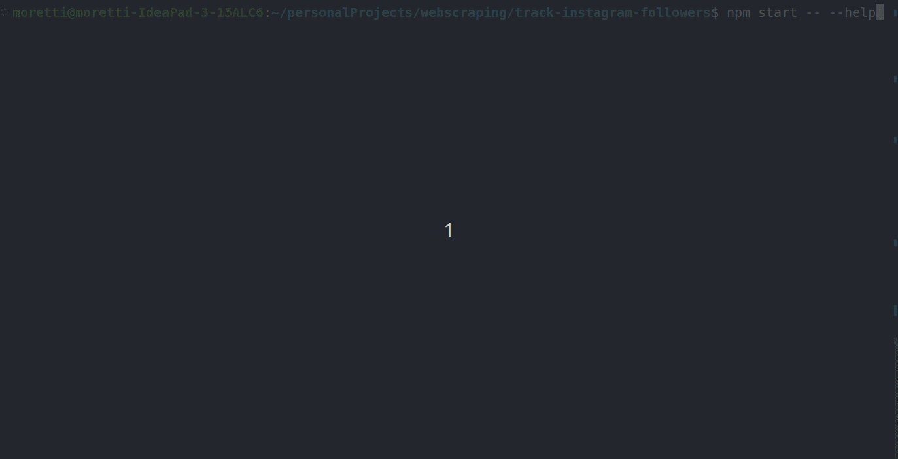

## Instagram Web Scraper

Este é um projeto de web scraping para extrair informações do Instagram usando o Puppeteer. O programa faz o login em uma conta do Instagram e extrai informações de um perfil específico.

## 👀 Overview

Este é um gif demonstrando o projeto

## 🔧 Tecnologias

Este projeto utiliza as seguintes tecnologias:

    Chalk - Para colorir a saída do console
    Chalk-table - Para exibir tabelas coloridas no console
    Dotenv - Para carregar variáveis de ambiente a partir de um arquivo .env
    Puppeteer - Para realizar a automação do navegador
    Yargs - Para criar uma interface de linha de comando

## 💻 Pré-requisitos

Para executar este projeto, você precisará das seguintes coisas instaladas em seu computador:

    Node.js (v14 ou superior)
    npm (v6 ou superior)
    Uma conta do Instagram com um nome de usuário e senha

## 🧐 Contribuindo

Se você quiser contribuir para este projeto, siga estes passos:

    Fork este repositório
    Crie uma nova branch (git checkout -b nova-feature)
    Faça as alterações desejadas e faça commit das suas mudanças (git commit -am 'Adiciona nova feature')
    Envie para o branch (git push origin nova-feature)
    Crie um novo Pull Request e aguarde o feedback

## 🔑 Licença

Este projeto está licenciado sob a licença MIT. Consulte o arquivo LICENSE para obter mais informações.

&nbsp;

Developed with 💜 by Gabriel Moretti
